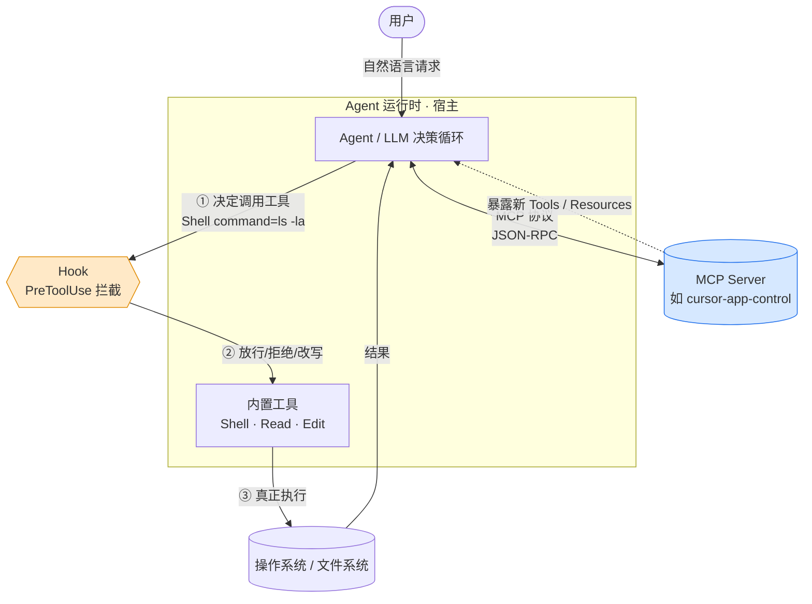
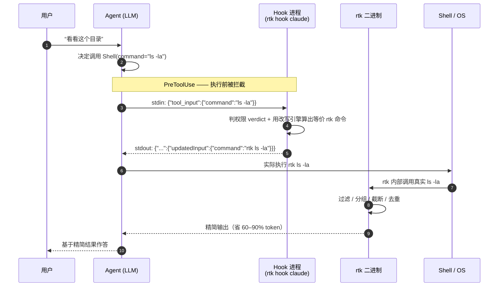

# Agent · Tool · Hook · MCP —— 以 rtk 为例理解 LLM 工具生态

> **For Agent（速读）**：本文用 `rtk`（一个把 shell 命令输出压缩 60–90% 的 CLI 工具）作为真实案例，讲清 4 个常被混为一谈的概念：**Agent（决策大脑）· Tool（能调用的手）· Hook（夹在决策与执行之间的拦截器）· MCP（给 Agent 插新工具的标准协议）**。核心结论：**Hook 和 MCP 是两条正交的扩展轴——Hook 拦截/改写「已有的工具调用」，MCP 给 Agent「新增工具与数据源」。rtk 走的是 Hook 这条路，而不是 MCP。**

---

## 0. 一句话定位

| 概念 | 角色比喻 | 一句话 |
|------|----------|--------|
| **Agent** | 大脑 | 由 LLM 驱动的循环：读需求 → 决定调用哪个工具 → 看结果 → 再决定，直到完成任务。 |
| **Tool** | 手 | Agent 能直接调用的原子能力，如 `Shell`、`Read`、`Edit`。 |
| **Hook** | 门口的安检/翻译 | 在「Agent 决定调用工具」与「工具真正执行」之间插一段代码，可**放行 / 拒绝 / 改写**这次调用。 |
| **MCP** | 通用插座 | Model Context Protocol，一套标准的客户端-服务器协议，让 Agent 能即插即用地接入**外部工具、数据、资源**。 |

关键洞察先说在前面：

- **Tool 是被调用的对象**，Agent 是发起调用的主体。
- **Hook 是「调用」这个动作上的中间件**——它不新增能力，而是拦截、修饰已有的调用。
- **MCP 是「新增能力」的标准化通道**——它把外部世界的功能变成 Agent 工具箱里的新工具。

所以：**Hook ⟂ MCP**。前者是横切（cross-cutting）的拦截层，后者是纵向的能力扩展层。二者可以同时存在、互不冲突。

---

## 1. 四个概念逐个拆解

### 1.1 Agent（智能体）

Agent 不是「一次问答」，而是一个**循环**：

```
loop:
    观察（用户消息 + 上一步工具结果）
    → LLM 推理，决定下一步动作（调用某工具 / 直接回答）
    → 若调用工具：发起 tool call，拿到结果
    → 回到 observe
until 任务完成
```

在本案例里，"Agent" 就是你在 Cursor / Claude Code 里对话的那个 AI。它自己不会执行 `ls`，而是**请求宿主运行时**帮它调用 `Shell` 工具。

### 1.2 Tool（工具 / 工具调用）

Tool 是 Agent 能发起的**结构化调用**，通常由宿主（Cursor、Claude Code 等）内置实现：

- `Shell` / `Bash`：执行终端命令
- `Read` / `Edit` / `Write`：读写文件
- `Grep` / `Glob`：搜索

Agent 输出的不是「跑了 ls」，而是一个意图：`Shell(command="ls -la")`。**真正执行的是宿主运行时**，然后把结果回灌给 Agent。正因为「意图」和「执行」是分离的两步，中间才有插入 **Hook** 的空间。

### 1.3 Hook（钩子）

Hook 是宿主在工具生命周期的固定时点暴露出来的**回调点**。最常用的是 `PreToolUse`（工具执行前）：

- 宿主在真正执行工具前，把这次调用的信息（JSON）交给你注册的 hook 命令；
- hook 通过 **stdin 收 JSON、stdout 回 JSON**；
- hook 的返回决定这次调用：**allow（放行）/ deny（拦截）/ ask（问用户）**，还可以返回 `updatedInput` **改写调用参数**。

> Hook 的本质是**中间件 / AOP 切面**：不改 Agent、不改 Tool，却能在二者之间做转换。`rtk` 正是一个 `PreToolUse` hook——把 `git status` 改写成 `rtk git status`。

### 1.4 MCP（Model Context Protocol）

MCP 是一套**开放协议**，规定 Agent（MCP Client）如何与外部 **MCP Server** 通信，从而使用 Server 暴露的三类东西：

- **Tools**：可调用的函数（带 JSON Schema 参数）
- **Resources**：可读取的数据（文件、记录、URI）
- **Prompts**：可复用的提示词模板

MCP 的价值是**标准化与解耦**：任何人写一个 MCP Server（数据库、Jira、浏览器、你的内部系统），任何支持 MCP 的 Agent 都能即插即用，无需为每个 Agent 单独适配。

> 本机就有一个真实 MCP Server：`cursor-app-control`。本文档创建前，我正是通过它的 `move_agent_to_root` 工具把工作根目录切换到了本知识库——这就是一次典型的 MCP 工具调用。

---

## 2. 它们如何组合（关系图）



读图要点：

1. **纵向（①→②→③）是「调用一个已有工具」的链路**，Hook 就卡在①和③之间，是横切的一层。
2. **右侧的 MCP 是另一条轴**：它不拦截调用，而是往 Agent 的工具箱里**塞进新工具/新数据**。
3. 两者互不排斥：一个 Agent 可以既挂着 rtk 这样的 Hook，又连着若干 MCP Server。

用一句话对照记忆：

> **Hook 管「怎么调」，MCP 管「能调什么」。**

---

## 3. rtk 案例：一条命令的完整生命周期

### 3.1 rtk 是什么

`rtk`（Rust Token Killer）是一个单文件 Rust CLI。它把常见开发命令（`ls`/`cat`/`grep`/`git`/`cargo test`/`docker ps`…）的**冗长输出过滤、去噪、压缩**，让回灌给 LLM 的内容少 60–90% 的 token，而信息基本不丢。

它接入 Agent 的方式**不是 MCP，而是 Hook**：注册一个 `PreToolUse` 钩子，把 Agent 想跑的原始命令 `X` 改写成 `rtk X`。

### 3.2 一次 `ls -la` 的时序



逐步说明：

1. **Agent 只表达意图**：它想跑 `ls -la`，并不知道 rtk 的存在。
2. **Hook 拦截并改写**：宿主把命令以 JSON 喂给 `rtk hook claude`，rtk 返回 `updatedInput`，把命令换成 `rtk ls -la`。
3. **执行被改写后的命令**：宿主运行 `rtk ls -la`；rtk 在内部真正跑 `ls -la`，再把结果压缩。
4. **Agent 收到的是压缩结果**：它对「被换过命令」这件事无感——这正是 Hook 中间件的优雅之处：**对 Agent 透明**。

### 3.3 真实证据（本机实测）

这一节把上面的抽象落到本机可验证的事实上：

- **注册点** —— `~/.claude/settings.json`：

  ```json
  { "hooks": { "PreToolUse": [
    { "matcher": "Bash",
      "hooks": [ { "type": "command", "command": "rtk hook claude" } ] }
  ] } }
  ```

- **改写行为** —— 会话中执行 `ls -la /tmp/...`，返回的不是普通 `ls` 的 `-rw-r--r-- 1 user staff … 日期`，而是 rtk 的压缩格式 `644  路径  大小`；`rtk gain --history` 里也确实记录了 `rtk ls -la … -55%`。说明命令被 Hook 悄悄换成了 `rtk ls -la`。

- **协议形状** —— rtk 的 hook 从 `/tool_input/command` 读命令，改写时输出：

  ```json
  { "hookSpecificOutput": {
      "permissionDecision": "allow | ask",
      "updatedInput": { "command": "rtk ls -la" } } }
  ```

  无对应 rtk 等价命令时，输出 `{}` 表示「不干预，照原样执行」。

---

## 4. 对照实验：同一个 rtk，两条 Hook 路径

rtk 同时提供了 **Claude 风格**与 **Cursor 风格**两套 hook。它们注册在不同文件、用不同子命令：

| | Claude 路径 | Cursor 原生路径 |
|---|---|---|
| 注册文件 | `~/.claude/settings.json` | `~/.cursor/hooks.json` |
| hook 命令 | `rtk hook claude` | `rtk hook cursor` |
| matcher | `Bash` | `Shell` |
| 何时改写 | verdict = **Allow 或 Ask/默认** 都改写 | **仅 verdict = Allow** 才改写，否则回 `{}` |
| allow 规则来源 | Claude 的 settings 权限 | `~/.cursor/cli-config.json` 的 `permissions.allow` |

实测差异：本机 `~/.cursor/cli-config.json` **不存在**，即 Cursor 路径没有任何 allow 规则 → 手动把 `ls`/`git status`/`cargo test` 喂给 `rtk hook cursor` **全部返回 `{}`（不改写）**。因此当前**真正在省 token 的是 Claude 路径**，Cursor 原生 hook 虽已注册但「空转」。

> 教学点：**同样是 Hook，返回策略不同，效果就天差地别。** Hook 的行为完全由它自己的返回值 + 宿主对返回值的解释决定；理解一个集成时，务必看它在「默认/ask」情形下到底放不放行、改不改写。

---

## 5. 如果 rtk 改用 MCP 会怎样？——选型对比

假设把 rtk 做成一个 MCP Server（暴露 `rtk_ls`、`rtk_git_status`… 等工具），会发生什么？

| 维度 | Hook 方案（rtk 实际选择） | MCP 方案（假想） |
|------|--------------------------|------------------|
| 对 Agent 透明性 | ✅ 完全透明，Agent 照常想 `ls` 就行 | ❌ Agent 必须**主动改口**去调 `rtk_ls`，否则享受不到压缩 |
| 覆盖面 | ✅ 一个 hook 覆盖**所有** shell 命令 | ❌ 每个命令要单独定义一个 MCP 工具 |
| 是否新增能力 | ❌ 不新增，只优化已有的 Shell 调用 | ✅ 表现为一批新工具 |
| 与既有工作流兼容 | ✅ 用户/Agent 的命令习惯不变 | ⚠️ 需要教育 Agent 优先用新工具 |
| 适合的目标 | **横切增强**：日志、脱敏、限流、审计、压缩 | **能力扩展**：接数据库、Jira、浏览器、内部 API |

**结论**：rtk 的目标是「在**不改变** Agent 行为的前提下，**横切地**压缩所有命令输出」。这正是 Hook 的主场；用 MCP 反而要求 Agent 改变调用习惯、逐一适配，得不偿失。反过来，若目标是「让 Agent 会一件它原本完全不会做的事」（比如查你司内部工单系统），那 MCP 才是正解。

**一句话选型准则**：

> 想**改造已有调用**（拦截/改写/审计/压缩）→ 用 **Hook**；
> 想**新增一类能力/数据源**并跨 Agent 复用 → 用 **MCP**。

---

## 6. 术语速查表

| 术语 | 英文 | 定位 | 交互形式 | 本案例中的实例 |
|------|------|------|----------|----------------|
| 智能体 | Agent | 决策主体 | LLM 循环 | Cursor / Claude Code 里的 AI |
| 工具 | Tool | 被调用的能力 | 结构化 tool call | `Shell`、`Read` |
| 钩子 | Hook | 调用的中间件 | stdin/stdout JSON | `rtk hook claude`（PreToolUse） |
| 模型上下文协议 | MCP | 能力扩展协议 | Client↔Server（JSON-RPC） | `cursor-app-control` Server |

关系再压缩成一行：

```
用户 → [ Agent 决策 ] → (Hook 拦截/改写) → [ Tool 执行 ] → 结果 → Agent
                          ⟂
                   [ MCP Server 提供新的 Tool/Resource ]
```

---

## 7. 参考（本机路径）

- Claude 侧 hook 注册：`~/.claude/settings.json`
- Cursor 侧 hook 注册：`~/.cursor/hooks.json`
- Cursor allow 规则来源：`~/.cursor/cli-config.json`（本机不存在）
- rtk 配置：`~/Library/Application Support/rtk/config.toml`
- rtk 用量统计：`rtk gain` / `rtk gain --history`
- rtk 源码（改写与权限判定）：`src/hooks/hook_cmd.rs`、`src/hooks/permissions.rs`
- rtk 仓库：<https://github.com/rtk-ai/rtk>
- MCP 规范：<https://modelcontextprotocol.io>
