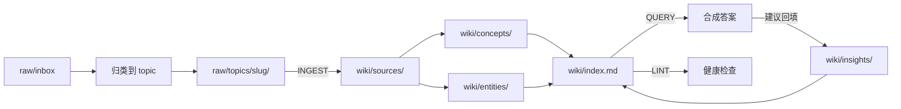

# Shuaikx 个人知识库构建计划

> 基于 [Karpathy LLM Wiki](https://gist.github.com/karpathy/442a6bf555914893e9891c11519de94f) 模式，为工作技术笔记 + 课题研究定制的实施方案。
>
> 状态：Phase 0 已执行 | 最后更新：2026-07-03

---

## 1. 需求确认

| 维度 | 你的选择 | 设计影响 |
|------|----------|----------|
| 内容范围 | 工作为主 + 按课题建子库 | `raw/topics/<slug>/` 与 `wiki/topics/<slug>/` 镜像 |
| 预期规模 | 中等（50–200 篇） | v1 核心 + 轻量 v2 预埋；~80 页后加 qmd |
| Agent 环境 | Cursor + Claude Code | `AGENTS.md` 为主 Schema，`CLAUDE.md` 指向它 |
| 现有文件 | 先建结构，迁移延后 | Phase 0 不动根目录零散 `.md` |
| 自动化 | 半自动 | 固定 INGEST/QUERY/LINT 命令 + query 建议回填 |

---

## 2. 架构总览

### 2.1 三层模型

```
┌─────────────────────────────────────────────────────────┐
│  Layer 3 — Schema（人 + LLM 共同演进）                    │
│  AGENTS.md · CLAUDE.md · .cursor/rules/kb.mdc            │
├─────────────────────────────────────────────────────────┤
│  Layer 2 — Wiki（LLM 维护，人只读）                       │
│  wiki/index.md · concepts/ · entities/ · insights/       │
├─────────────────────────────────────────────────────────┤
│  Layer 1 — Raw Sources（人放入，LLM 只读）                │
│  raw/topics/ui-spec/ · raw/inbox/                        │
└─────────────────────────────────────────────────────────┘
```

### 2.2 数据流



### 2.3 为什么选这个方案

- **Karpathy v1 核心**：ingest / query / lint 三操作，index.md 导航，适合当前小规模起步。
- **轻量 v2 预埋**：frontmatter（confidence、status）、insights 回填、矛盾标注——不引入完整图谱或 RAG。
- **课题子目录**：满足「UI 规范」「功能调研」分库，又保持单 vault 统一检索。
- **整仓即 Obsidian 库**：Cursor / Claude Code / Obsidian 打开同一目录，零同步成本。

**明确不做（现阶段）**：

- 多 vault 拆分
- 向量数据库 / 完整 RAG 管线
- v3 分段多 Agent 编排
- 现有根目录文件自动迁移

---

## 3. 目录结构

```
Shuaikx/
├── raw/                              # Layer 1：原始资料（只读）
│   ├── inbox/                        # Web Clipper / 未分类暂存
│   └── topics/
│       ├── ui-spec/                  # 课题：UI 规范与组件
│       └── feature-research/         # 课题：功能调研
│
├── wiki/                             # Layer 2：编译后知识（LLM 维护）
│   ├── index.md                      # 全局目录
│   ├── log.md                        # 操作日志（append-only）
│   ├── hot.md                        # Session 热缓存
│   ├── overview.md                   # 知识库总览
│   ├── topics/
│   │   ├── ui-spec/index.md
│   │   └── feature-research/index.md
│   ├── sources/                      # 每个 raw 文件一篇摘要
│   ├── concepts/                     # 概念页（可跨课题）
│   ├── entities/                     # 实体页（组件、系统、Prefab）
│   └── insights/                     # QUERY 回填的分析
│
├── output/                           # 报告、Marp 幻灯片、图表
│
├── .obsidian/                        # Obsidian 配置（仓库根）
├── .cursor/rules/kb.mdc              # Cursor KB 规则
├── AGENTS.md                         # 主 Schema
├── CLAUDE.md                         # Claude Code 入口
├── 欢迎.md                           # Obsidian 首页指针
├── KB_BUILD_PLAN.md                  # 本文件
└── Karpathy_LLM_KB.md                # 参考文档，不纳入 wiki
```

### 3.1 课题（Topic）管理

| Slug | 名称 | 用途 | 未来迁移来源 |
|------|------|------|--------------|
| `ui-spec` | UI 规范 | AOE3D UI 组件、iwiki 规范、控件库 | `UI组件.md`、`iwiki_4013196232_子文档总结.md` |
| `feature-research` | 功能调研 | 新功能调研、方案对比 | `AttrViewer-TreeView-ID冲突修复.md` 等 |

**新增课题**：在 `raw/topics/` 和 `wiki/topics/` 下建同名目录，更新 `wiki/index.md` 和 `AGENTS.md` 课题表。

---

## 4. Schema 规范（AGENTS.md 摘要）

完整规范见 [AGENTS.md](AGENTS.md)。

### 4.1 页面类型

| type | 目录 | 说明 |
|------|------|------|
| `source` | `wiki/sources/` | 对应一篇 raw 文件的摘要，事实为主 |
| `concept` | `wiki/concepts/` | 抽象概念（如「UI 栈」「弹窗冲突队列」） |
| `entity` | `wiki/entities/` | 具体实体（如 `ListBox`、`Menu_HeroDetail`） |
| `insight` | `wiki/insights/` | QUERY 合成的分析、对比、决策记录 |
| `synthesis` | `wiki/topics/*/index.md` | 课题级综述 |

### 4.2 Frontmatter 模板

```yaml
---
type: concept
topic: ui-spec
sources:
  - raw/topics/ui-spec/example.md
confidence: 0.85
date_updated: 2026-07-03
status: current
tags:
  - wiki/concept
  - topic/ui-spec
---
```

| 字段 | 说明 |
|------|------|
| `confidence` | 0–1；多源印证越高；lint 时可衰减 |
| `status` | `current` / `stale` / `superseded` |
| `sources` | 溯源到 raw 或 wiki/sources |

### 4.3 页面结构

每篇 wiki 页应包含：

1. **Frontmatter**（见上）
2. **`## For Agent`** — 3–5 句：本页用途、核心结论、关键链接
3. **正文** — 结构化小节，多用 `[[wikilinks]]`
4. **外部 claim** — 标注 `last_verified: YYYY-MM-DD`

---

## 5. 三操作工作流

### 5.1 INGEST

**触发**：`INGEST: raw/topics/ui-spec/某文件.md`

**步骤**（Agent 必须按序执行）：

1. 确认 raw 文件存在；**不修改 raw/**
2. 在 `wiki/sources/` 创建或更新 source 页（文件名与 raw 对应）
3. 提取 concept / entity，创建或更新 `wiki/concepts/`、`wiki/entities/`
4. 更新 `wiki/topics/<slug>/index.md`
5. 更新 `wiki/index.md`（每条：链接 + 一行摘要）
6. 追加 `wiki/log.md`
7. 若与现有页矛盾：**标注矛盾**，不静默覆盖；新 claim 可标 `status: current`，旧 claim 标 `stale`

### 5.2 QUERY

**触发**：自然语言提问，或 `QUERY: deep <问题>`

**步骤**：

1. 读 `wiki/hot.md`（若有近期上下文）
2. 读 `wiki/index.md` + 相关 `wiki/topics/*/index.md`
3. 读匹配页（source → concept → entity）
4. 合成答案，**引用 wiki 路径**
5. 若引用 ≥ 3 页或产生新洞察 → **建议**保存到 `wiki/insights/`，等用户确认

**深度模式**（`QUERY: deep`）：可补充 web search，但答案仍以 wiki 为主、标注外部来源。

### 5.3 LINT

**触发**：`LINT` 或每 2 周

**检查项**：

| 检查 | 动作 |
|------|------|
| 断链 wikilink | 自动修复或报告 |
| orphan 页（无入链） | 报告，建议补链 |
| `status: stale` 未处理 | 报告 |
| 矛盾未解 | 报告，提议 supersession |
| 反复提及却无 concept 页 | 建议新建 |
| `index.md` 与实有页面不一致 | 自动同步 |

---

## 6. 分阶段路线图

### Phase 0 — 脚手架 ✅

- [x] 目录树、`AGENTS.md`、`CLAUDE.md`、`.cursor/rules/kb.mdc`
- [x] wiki 种子页
- [x] `.obsidian` 迁到仓库根
- [x] `欢迎.md` 指向 `wiki/overview.md`

### Phase 1 — 校准（进行中）

1. [x] 复制 `UI组件.md` → `raw/topics/ui-spec/`
2. [x] INGEST 生成 6 篇 wiki 页
3. [ ] 执行 `QUERY: ListBox 和 TemplateBox 有什么区别？`
4. [ ] 执行 `LINT`
5. [ ] ingest `iwiki_4013196232_子文档总结.md`

### Phase 2 — 日常半自动（50 篇内）

| 场景 | 做法 |
|------|------|
| 新文章 | Obsidian Web Clipper → `raw/inbox/` → 归类 → INGEST |
| 深度问答 | QUERY → 接受 insight 回填建议 |
| 维护 | 双周 `LINT` |
| Session | 开始读 `hot.md`；结束更新 `hot.md` |

### Phase 3 — 中等规模（50–200 篇）

**触发条件**：`index.md` > 80 条，或 QUERY 明显变慢

1. 安装 [qmd](https://github.com/tobi/qmd)，索引 `wiki/`
2. Agent 通过 `qmd query` 或 MCP 检索
3. 启用 confidence 衰减、supersession 链（lint 时批量）
4. 仍不必上向量数据库

### Phase 4 — 远期可选

- 根目录零散文件批量 INGEST
- Obsidian Marp 插件 + `output/` 幻灯片
- 超 200 篇：评估 Wiki+RAG 混合

---

## 7. 现有资产迁移清单（延后执行）

| 文件 | 目标 | 备注 |
|------|------|------|
| `UI组件.md` | `raw/topics/ui-spec/` | 高优先级试 ingest |
| `iwiki_4013196232_子文档总结.md` | `raw/topics/ui-spec/` | 与 UI 课题合并 |
| `AttrViewer-TreeView-ID冲突修复.md` | `raw/topics/feature-research/` | 或新建 `debug-notes` |
| `agent_summary/*.md` | ingest → `wiki/insights/` | episodic 材料 |
| `AttrViewerWindow copy.cs` | 不纳入 | 代码文件 |
| `Karpathy_LLM_KB.md` | 保留根目录 | 元参考 |
| `Obsidian_KB/` | 可删除 | `.obsidian` 已迁到根 |

---

## 8. 工具与环境

| 工具 | 用途 |
|------|------|
| **Cursor** | 日常 INGEST / QUERY / LINT（读 `.cursor/rules/kb.mdc`） |
| **Claude Code** | 同上（读 `CLAUDE.md` → `AGENTS.md`） |
| **Obsidian** | 浏览 wiki、图谱、Marp（打开仓库根目录） |
| **Obsidian Web Clipper** | 网页 → `raw/inbox/` |
| **qmd**（Phase 3） | 本地混合搜索 |

### Obsidian 打开方式

1. Obsidian → Open folder as vault
2. 选择 `C:\Users\kexishuai\Documents\Shuaikx`
3. 从 [[欢迎]] 或 [[wiki/overview]] 开始浏览

---

## 9. 成功标准

- [ ] 新资料路径：`inbox` → 归类 → INGEST → Obsidian 可见
- [ ] Cursor 与 Claude Code 行为一致（同一 AGENTS.md）
- [ ] QUERY 返回带 wiki 链接的答案
- [ ] LINT 能发现断链与 orphan
- [ ] insights 随探索累积
- [ ] 200 篇前无需架构重构

---

## 10. 快速命令参考

```
INGEST: raw/topics/ui-spec/文件名.md
QUERY: 你的问题
QUERY: deep 你的问题
LINT
```

Session 开始可说：`读 wiki/hot.md，继续上次上下文。`

---

## 附录 A：与 Karpathy 原方案对照

| Karpathy 原案 | Shuaikx 实现 |
|---------------|--------------|
| raw/ | raw/ + topics 子目录 |
| wiki .md | wiki/ 分 sources/concepts/entities/insights |
| Obsidian IDE | 整仓为 vault |
| index.md | 全局 + 课题级双 index |
| CLAUDE.md schema | AGENTS.md + CLAUDE.md + kb.mdc |
| 手写 search | Phase 3 用 qmd |
| lint | LINT 命令 + 半自动 |

## 附录 B：参考链接

- [Karpathy llm-wiki gist](https://gist.github.com/karpathy/442a6bf555914893e9891c11519de94f)
- [LLM Wiki v2 (rohitg00)](https://gist.github.com/rohitg00/2067ab416f7bbe447c1977edaaa681e2)
- [qmd 本地搜索](https://github.com/tobi/qmd)
- [astro-han/karpathy-llm-wiki skill](https://github.com/Astro-Han/karpathy-llm-wiki)
