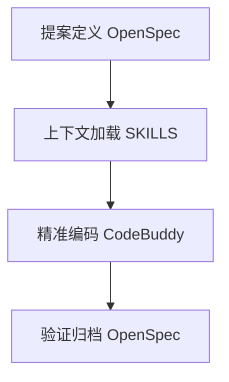

> **溯源说明（二次抓取）**  
> - 目标文：《CodeBuddy+OpenSpec+Skills 我在100万行老项目中的AI编程实践》  
> - KM：`https://km.woa.com/articles/show/648705` — WebFetch 再次超时，未拿到原文。  
> - 主源：[iWiki 4017351646](https://iwiki.woa.com/p/4017351646)（标题接近原文，页首「原文链接」指向 KM #648705）— 下文 **§一～§五** 尽量保留该页提取正文。  
> - 补充：[iWiki 4022217760](https://iwiki.woa.com/p/4022217760)（页首写明「来源：KM 文章 #648705」）— **§补充** 收录主源未覆盖的安装命令、46 项 SKILLS 分类、实践效果表、模式对比与收束金句。  
> - 结果性质：**可访问镜像的 best-effort 重建，不是 KM 逐字原文**。文中无外部图片；无签名 URL。

# CodeBuddy+OpenSpec+Skills 我在100万行老项目中的AI编程实践

*KM #648705 · 二次抓取重建*

原文链接：https://km.woa.com/articles/show/648705

---

## 一、三大AI编程模式

### 1. Vibe Coding——自由但混乱的起点

作为AI编程的初始尝试，Vibe Coding模式的核心是“即时对话、随手改码”，无需额外流程，在修复单个小Bug、调整UI样式、修改简单配置等轻量场景下，能快速完成需求，具备一定灵活性。

但该模式的致命缺陷的无法适配老项目的复杂场景：AI不懂项目架构与模块依赖，不了解团队约定的编码规范，每次生成代码后都需反复纠正，最终导致“教AI写代码”的时间远超自己编码，反而降低效率。

基于实践总结，Vibe Coding仅适用于轻量、独立的简单需求，一旦涉及核心业务、跨模块修改，必须放弃该模式，避免造成更大内耗。

### 2. Spec-Kit——理想但沉重的SDD实现

意识到Vibe Coding的混乱问题后，引入了SDD（规范驱动开发）方法论，核心思路是“先定义、后实现”，通过编写详细规格文档引导AI生成代码，而Spec-Kit作为SDD的完整工具实现，成为我当时的核心尝试方向。

Spec-Kit的理论优势显著，能通过结构化流程解决上下文缺失和流程混乱问题，但实践落地时却水土不服：流程过于繁重，一个小功能需走完7个阶段，编写大量规格文档，耗时耗力；同时token消耗巨大，且更适配从0到1的新项目，无法应对老项目的历史包袱和快速迭代需求。

### 3. OpenSpec——老项目适配的轻量级SDD方案

OpenSpec继承了SDD“先定义、后实现”的核心思想，同时去掉冗余流程，完美适配老项目的迭代需求，成为我解决流程规范问题的核心工具。

OpenSpec的核心优势，结合老项目实践场景总结如下：

1. **流程简化**：仅需“提案→实现→归档”三步，无需冗余文档，既能规范开发流程，又不影响迭代效率；
2. **变更隔离**：每个功能变更放置在独立的 `changes/` 目录下，有效避免修改混乱，适配老项目“安全迭代”的核心需求；
3. **可追溯性**：每一次变更都能清晰记录修改人、修改内容及修改原因，为团队协作和后期维护提供明确依据。

需要注意的是，OpenSpec仅解决了“流程规范”问题，AI上下文缺失的核心痛点仍未突破，为此需要构建SKILLS体系，填补这一空白。

---

## 二、让AI自主学习项目——SKILLS体系构建

OpenSpec解决了“怎么做”的流程问题，而SKILLS体系则解决了“AI懂项目”的上下文问题，是老项目AI编程的“杀手锏”。

### 什么是SKILLS？

SKILLS本质是项目专属知识库，是给AI准备的“项目入职手册”，将项目的技术架构、代码规范、设计模式、历史约束等“潜规则”，封装成可复用的Markdown模块，核心优势：

- **渐进式披露**：AI优先读取元数据（约100token），仅在任务匹配时加载完整内容，高效利用token；
- **模块化组织**：每个技能独立存储，按功能分类，便于维护和复用；
- **可共享性**：通用技能可跨项目共享，沉淀为团队技术资产。

### 为什么要让AI自主学习项目？

核心痛点：反复手动向AI解释项目背景，效率极低；而让AI一次性学习项目、沉淀知识，能彻底解放开发者，让AI从“懵懂新手”变成“懂项目的助手”。

### SKILLS生成方法：主动对话式生成

无需手动编写，利用大模型的总结归纳能力，通过对话式生成，流程更高效、内容更精准：

1. **确定类别**：规划核心技能类别（如开发规范、架构设计、模块实现等）；
2. **对话生成**：针对每个类别，与CodeBuddy详细对话，让其生成对应的Markdown文档；
3. **人工校验**：补充项目特有约束、修正偏差，确保技能准确性；
4. **分类归档**：按类别整理到对应目录，形成完整SKILLS体系。

构建SKILLS后，需设置“上下文优先规则”，强制AI在编码前读取相关技能，确保理解上下文后再动手，核心规则流程：

1. **先读全局架构**：优先读取全局架构技能，建立系统全景认知；
2. **识别变更模块**：根据需求确定涉及的模块/服务；
3. **加载相关技能**：调用对应模块的技能文档，了解规范和依赖；
4. **执行编码变更**：在充分理解上下文的基础上，生成或修改代码。

**规则放置**：将规则文件放入 `.codebuddy/rules` 目录，CodeBuddy可自动读取。

---

## 三、最优工作流：CodeBuddy+OpenSpec+Skills 三者协同

结合三者优势，形成老项目AI编程的标准工作流，实现“流程规范+上下文清晰+编码高效”：

### 提案定义（OpenSpec）

在 `changes/` 目录创建 `proposal.md`，清晰描述需求背景、实现约束、验收标准，明确“做什么”，避免需求发散。

### 上下文加载（SKILLS）

AI根据“上下文优先规则”，自动加载全局架构技能+相关模块技能，完整掌握项目规范和依赖，不再“盲人摸象”。

### 精准编码（CodeBuddy）

CodeBuddy基于OpenSpec的规格要求和SKILLS的上下文，精准生成代码：

- 明确修改文件范围；
- 严格遵循项目代码规范；
- 正确处理模块间依赖；
- 避免破坏现有业务逻辑。

### 验证归档（OpenSpec）

编码测试完成后，通过OpenSpec归档命令，保存提案、规格、任务清单等所有记录，便于后续审计和追溯。

工作流结构示意（非原文配图，approximate）：



---

## 四、经验教训与最佳实践

结合百万行老项目实践，总结核心经验，帮助大家避坑：

### SKILLS构建原则

- **从问题出发**：无需一次性整理所有内容，遇到模块问题再补充对应技能；
- **保持更新**：代码变更后，同步更新对应的SKILLS文档，避免脱节；
- **团队共建**：鼓励团队成员共同维护，让SKILLS成为团队共享知识库。

### OpenSpec使用技巧

- **变更要小**：一个提案仅实现一个功能，便于管理和回滚；
- **描述要细**：提案中明确业务场景、约束条件、验收标准，减少歧义；
- **及时归档**：功能完成后立即归档，保持 `changes/` 目录整洁。

### 上下文规则优化

- **逐步迭代**：规则从简单开始，逐步丰富流程、模块对应关系和场景示例；
- **灵活调整**：若技能内容与实际代码冲突，以实际代码为准，并及时更新技能文档。

---

## 五、给老项目AI编程实践者的建议

如果你的项目符合以下特征：老项目、历史包袱重、代码量大、团队水平参差不齐、AI帮忙总添乱，建议按以下四步落地：

1. **优先梳理全局架构**：让AI帮你梳理项目结构，生成全局架构SKILLS，这是最核心的一步；
2. **解决核心痛点**：从最常修改、AI最易出错的模块入手，补充该模块的SKILLS；
3. **建立基础规则**：编写简单的上下文优先规则，让AI养成“先读文档、再动手”的习惯；
4. **结合OpenSpec**：用OpenSpec管理变更，实现“一个功能一个提案”，确保流程规范和可追溯。

---

## 补充：结构化整理页中的额外细节

> 来自 [iWiki 4022217760](https://iwiki.woa.com/p/4022217760)，页首标注「来源：KM 文章 #648705」。以下内容主源转载页未逐条收录，作补充事实块；可能经整理压缩，**不能当作 KM 原文逐字段落**。

### 核心矛盾（补充表述）

AI 是“无记忆的聪明全才”，记忆范围仅限上下文窗口。老项目有大量私有知识（架构规范、模块约定、历史决策），AI 无法自行获取。

核心思想：

> **在有限的上下文里，尽可能提供高信噪比、准确的信息给 AI。**

三层架构：

```
┌─────────────────────────────────────────┐
│  CodeBuddy  — 理解上下文 + 写代码        │
├─────────────────────────────────────────┤
│  OpenSpec   — 记录需求、设计、变更过程    │
├─────────────────────────────────────────┤
│  SKILLS     — 沉淀项目私有知识的知识库    │
└─────────────────────────────────────────┘
```

### OpenSpec 安装与指令（补充）

```bash
# 安装
npm install -g @tencent-ai/codebuddy-code
npm install -g @fission-ai/openspec@latest

# 初始化
cd your-project && openspec init

# 核心指令
/openspec:proposal [需求描述]   # 生成 proposal.md, design.md, tasks.md, specs/
/openspec:apply [change-id]     # 执行实现
/openspec:archive [change-id]   # 归档变更
```

目录结构：

```
openspec/
├── project.md      # 项目上下文（技术栈、架构、规范）
├── specs/          # 主规范库（已实现功能的规范）
├── changes/        # 变更提案目录
│   └── archive/    # 已归档变更
└── AGENTS.md       # AI 助手指令
```

### SKILLS 分类体系（补充，共 46 项）

- **开发规范类**：Git 提交规范、API 接口设计、单元测试、数据库脚本管理
- **架构设计类**：全局架构、微服务开发、事件驱动、设计模式
- **微服务模块类**：各模块架构和业务逻辑
- **技术专项类**：分布式锁、性能监控、重试机制、国际化
- **业务专项类**：流水线模型架构、变量生命周期

### 实践效果对比（补充）

| 场景 | 旧模式（Vibe Coding） | 新模式（OpenSpec+SKILLS） |
|------|----------------------|--------------------------|
| 新增流水线变量 | 5次修正仍失败 | 一次性生成符合规范的代码 |
| 修复分布式锁 | 生成不规范代码，险造线上故障 | 通过 SKILLS 自动匹配 Redisson 规范 |
| 日常功能开发 | 反复解释项目背景 | AI 主动读取相关 SKILLS |

### 三种模式适用场景（补充）

| 模式 | 适用场景 | 特点 |
|------|---------|------|
| **Vibe Coding** | 单个 Bug 修复、UI 调整、简单 CRUD | 速度快，无需额外文档 |
| **OpenSpec + SKILLS** | 新增功能、重构、跨模块修改、团队协作 | 变更可追溯，上下文清晰，最适合老项目迭代 |
| **Spec-Kit** | 全新项目搭建、架构设计 | 流程严谨，文档完整，适合从0到1 |

### 收束金句（补充）

> **VibeCoding**：自由，但不稳定  
> **Skills**：稳定，但偏机械  
> **Spec + Skills**：有约束的摇滚，稳定中带创造力  

最终方案的本质：**用 SKILLS 补充 AI 的“私有知识盲区”，用 OpenSpec 管理变更流程，让 CodeBuddy 在高质量上下文下精准执行**。
