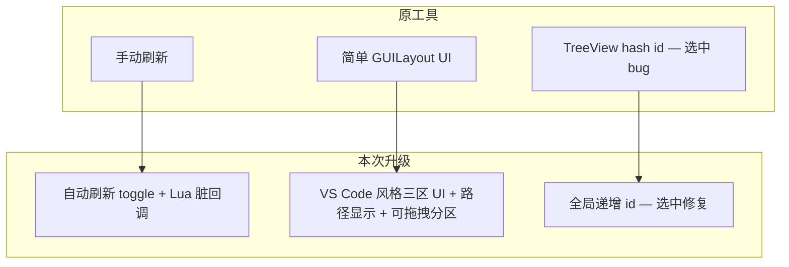

# AttrViewer 属性查看器 — 本次升级总结

> 项目：`AOE3D` · 入口：`AoE -> Lua -> 查看属性系统`（Alt+C）

---

## 工具背景

**AttrViewer** 是 Unity Editor 中的运行时 Lua 属性调试工具。在 Play 模式且已登录时，从 `mgr.userAttr.root` 拉取属性树，结合 `attr_*_proto.lua` 做类型映射，支持搜索、监视、双击跳转 VS Code。

本次在原有工具基础上完成了 **Bug 修复**、**自动刷新**、**UI 全面改造** 三类升级，涉及文件：


| 文件                                                  | 变更类型       |
| --------------------------------------------------- | ---------- |
| `Assets/Editor/AttrViewer/AttrViewerWindow.cs`      | 修改（核心）     |
| `Assets/Scripts/.Lua/Util/AttrViewerEditorUtil.lua` | 新增         |
| `Assets/Scripts/.Lua/Launcher.lua`                  | 修改（退出清理钩子） |


---

## 一、Bug 修复：选中联动高亮

### 问题

在 `yzPresetTeam.presetTeamData` 等嵌套结构中，点击某一行的 `commanderToPresetTeamId = {number} 0` 时，**多个索引下同名同值的字段会同时被高亮**，看起来像「按字段名联动选中」。

### 根因

Unity `TreeView` 的选中基于**整数 id**。原实现中叶子节点用 `displayName.GetHashCode()` 生成 id，同名同值字段共享同一 id，导致多行同时高亮。同时 `LuaTableTreeViewItem` 虽传入递增 `Id`，但构造函数 `base` 仍调用 `GetStableId`，递增 id 未真正生效。

### 修复方案

- 全树统一使用全局递增 `LuaTableTreeViewItem.Id`
- 构造函数直接使用传入的 `id`，删除 `GetStableId` 方法
- 最小改动，保证同一次构建内每个节点 id 唯一

### 修复后效果


修复前：多行同时高亮
*（图 1）修复前：点击单行，多个同名同值字段一起高亮*


修复后：仅单行高亮
*（图 2）修复后：仅当前点击行高亮*

> 详细说明见：`AttrViewer-TreeView-ID冲突修复.md`

---

## 二、新功能：自动刷新

### 需求

属性数据在运行时变化后，窗口应**自动更新**树视图与监视列表，无需每次手动点「刷新」。

### 实现架构

```
属性推送 → DirtyTable → rootAttr 顶层 dirty
    → AttrViewerEditorUtil (Lua) 回调
    → C# AttrRefreshCall delegate
    → m_pendingAutoRefresh（帧级 debounce）
    → RefreshTable() + TreeView.Reload()
```

### 关键实现点

1. **工具栏「自动刷新」勾选框**
  Inspector 风格：左侧文字 + 右侧标准 Unity Toggle。
2. **Lua 桥接模块 `AttrViewerEditorUtil.lua`**
  - 在 `rootAttr` 18 个顶层字段上 `mgr.attr.query.rootAttr.xxx:Register(...)`  
  - listener key 使用 `{ __cname = "AttrViewerEditorUtil" }`（满足 Profiler 要求）  
  - 嵌套字段变化沿 dirty 树冒泡到顶层，一次推送即可触发刷新
3. **C# 侧**
  - 缓存 `AttrRefreshCall` delegate，避免 GC  
  - 注销时用 `LuaFunction.Action()` 而非废弃的 `Call()`  
  - `Launcher.OnCleanUpByCS` 中调用 `AttrViewerEditorUtil.OnCleanUp()` 清理监听

### 自动刷新 UI


自动刷新开关
*（图 3）工具栏「自动刷新」勾选框*

---

## 三、UI 改造：对标 VS Code Debug 面板

### 改造目标

将原先简单的 `GUILayout` + `GUI.skin.box` 布局，改造成接近 **VS Code Debug 侧栏** 的深色、分区、紧凑风格。

### 主要变化


| 维度   | 改造前          | 改造后                                 |
| ---- | ------------ | ----------------------------------- |
| 布局   | GUILayout 堆叠 | 基于 `Rect` 的精确分区布局                   |
| 视觉   | 默认浅色 box     | 深色底 `#252526`、分区标题、分隔线              |
| 分区   | 监视 + 变量树     | **监视** / **路径** / **变量** 三区         |
| 路径   | 无            | 选中节点显示相对路径（如 `root.user.xxx.field`） |
| 分区高度 | 固定 / 自适应     | 监视、路径区可**拖拽分界线**调整高度                |
| 持久化  | 无            | 面板高度 `[SerializeField]` 序列化保存       |


### 三区说明

1. **监视** — Watch 列表，键值分色，内容超出时分区内滚动
2. **路径** — 显示当前选中变量在属性系统中的相对路径；未选中显示 `(未选择)`
3. **变量** — 属性树 TreeView，去边框、交替行背景、紧凑行高 18px

### 技术要点

- 新增 `Styles` 静态类、`DrawSectionHeader`、`DrawHorizontalSplitter`
- 路径查询下沉到 `LuaTableTreeView` 子类（`TreeView.FindItem` / `rootItem` 为 protected）
- 多分区 resizable 布局：为每个可拖拽面板计算 min/max height，防止挤压变量区

### UI 效果示意


改造前 UI
*（图 4）改造前：简单 box 堆叠布局*


改造后 VS Code 风格 UI
*（图 5）改造后：VS Code Debug 风格 — 监视 / 路径 / 变量 三区，深色主题*


路径分区示例
*（图 6）选中变量后，路径分区显示 `root.xxx.field` 形式路径*


可拖拽分界线
*（图 7）监视 / 路径 之间的垂直分界线，支持拖拽调整高度*

---

## 升级全景一览




---

## 已知限制与后续可选


| 项             | 说明                                                 |
| ------------- | -------------------------------------------------- |
| 刷新后 id 变化     | 全局递增 id 在每次 `Reload` 后重置，展开/选中路径依赖 `fullPath` 恢复逻辑 |
| 自动刷新性能        | 高频属性推送下仅有帧级 debounce；极端场景可考虑按 dirty path 过滤        |
| `SaveTable()` | 仍为未实现（`Debug.Log("未实现")`），属性编辑需单独设计                |
| 未实现增强         | 一键复制路径、Variables 树键值分色等（用户未要求）                     |


---

## 验证建议

1. **选中 bug**：在 `yzPresetTeam -> presetTeamData` 多索引场景下点击同名字段，确认仅单行高亮
2. **自动刷新**：勾选后修改运行时属性，确认树与监视列表自动更新；取消勾选无 Console 报错
3. **UI 拖拽**：多种窗口高度下拖动监视/路径分界线，确认 clamp 正常、变量区不被挤没
4. **生命周期**：长时间 Play、断线重连、退出 Play 后确认监听已正确注销

---

*文档生成时间：2026-07-06 · 基于 session_summary_143500 / 143600 / 143604 合并*