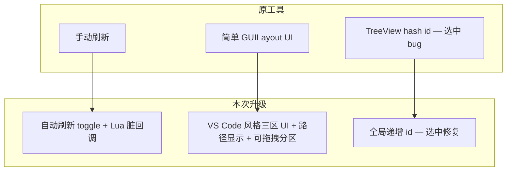

> 项目：`AOE3D` · 入口：`AoE -> Lua -> 查看属性系统`（Alt+C）

---

## 工具背景

**AttrViewer** 是 Unity Editor 中的运行时 Lua 属性调试工具。在 Play 模式且已登录时，从 `mgr.userAttr.root` 拉取属性树，结合 `attr_*_proto.lua` 做类型映射，支持搜索、监视、双击跳转 VS Code。

本次在原有工具基础上完成了 **Bug 修复**、**自动刷新**、**UI 全面改造** 三类升级，涉及文件：

| 文件                                                  | 变更类型       |
| --------------------------------------------------- | ---------- |
| `Assets/Editor/AttrViewer/AttrViewerWindow.cs`      | 修改（核心）     |
| `Assets/Scripts/.Lua/Util/AttrViewerEditorUtil.lua` | 新增         |
| `Assets/Scripts/.Lua/Launcher.lua`                  | 修改（退出清理钩子） |

---
## 一、Bug 修复：选中联动高亮

### 问题

在 `yzPresetTeam.presetTeamData` 等嵌套结构中，点击某一行的 `commanderToPresetTeamId = {number} 0` 时，**多个索引下同名同值的字段会同时被高亮**，看起来像「按字段名联动选中」。

### 根因

Unity `TreeView` 的选中基于**整数 id**。原实现中叶子节点用 `displayName.GetHashCode()` 生成 id，同名同值字段共享同一 id，导致多行同时高亮。同时 `LuaTableTreeViewItem` 虽传入递增 `Id`，但构造函数 `base` 仍调用 `GetStableId`，递增 id 未真正生效。

### 修复方案

- 全树统一使用全局递增 `LuaTableTreeViewItem.Id`
- 构造函数直接使用传入的 `id`，删除 `GetStableId` 方法
- 最小改动，保证同一次构建内每个节点 id 唯一

### 修复后效果

修复前：多行同时高亮
*（图 1）修复前：点击单行，多个同名同值字段一起高亮*


修复后：仅单行高亮
*（图 2）修复后：仅当前点击行高亮*


---
## 二、UI 改造：对标 VS Code Debug 面板

### 改造目标

将原先简单的 `GUILayout` + `GUI.skin.box` 布局，改造成接近 **VS Code Debug 侧栏** 的深色、分区、紧凑风格。

### 主要变化
| 维度   | 改造前             | 改造后                                 |
| ---- | ------------ | ----------------------------------- |
| 视觉   | 默认浅色 box     | 深色底 `#252526`、分区标题、分隔线              |
| 分区   | 监视 + 变量树     | **监视** + **路径** + **变量** 三个区域         |
| 节点路径   | 无            | 选中节点显示相对路径（如 `root.user.xxx.field`） |
| 分区高度 | 固定 / 自适应     | 监视、路径区可**拖拽分界线**调整高度，且面板高度 会被 序列化保存                 |

### 三区说明

1. **监视** — 监视变量列表，键值分色，内容超出时，可在分区内滚动
2. **路径** — 显示当前选中变量在属性系统中的相对路径，适用场景如：在属性树中搜索时，如遇到大量同名变量，能够根据路径获取目标属性；未选中时显示 `(未选择)`
3. **属性** — 属性树 TreeView

### 技术要点

- 新增 `Styles` 静态类、`DrawSectionHeader`、`DrawHorizontalSplitter`
- 路径查询下沉到 `LuaTableTreeView` 子类（`TreeView.FindItem` / `rootItem` 为 protected）
- 多分区 resizable 布局：为每个可拖拽面板计算 min/max height，防止挤压变量区

### UI 效果示意

改造前 UI
*（图 3）改造前：简单 box 堆叠布局*


改造后 VS Code 风格 UI
*（图 4）改造后：VS Code Debug 风格 — 监视 / 路径 / 变量 三区*


## 三、新功能：自动刷新

### 需求

属性数据在运行时变化后，窗口应**自动更新**树视图与监视列表，无需每次手动点「刷新」。

### 实现架构

```
属性推送 → DirtyTable → rootAttr 顶层 dirty
    → AttrViewerEditorUtil (Lua) 回调
    → C# AttrRefreshCall delegate
    → m_pendingAutoRefresh（帧级 debounce）
    → RefreshTable() + TreeView.Reload()
```

### 自动刷新 UI

自动刷新开关
*（图 5）工具栏「自动刷新」勾选框*


---
## 升级全景一览



---

## 已知限制与后续可选

| 项             | 说明                                                 |
| ------------- | -------------------------------------------------- |
| 自动刷新性能        | 高频属性推送下仅有帧级 debounce；极端场景可考虑按 dirty path 过滤        |
| `SaveTable()` | 仍为未实现（`Debug.Log("未实现")`），属性编辑需单独设计                |
