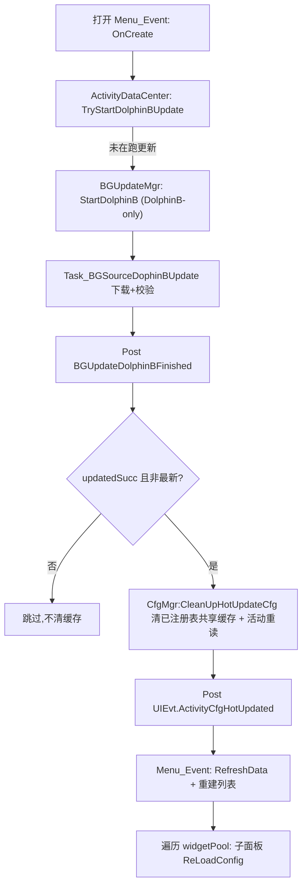

# DolphinB 活动配表热更接入

## 目标与范围
- 打开活动中心 `Menu_Event` 时,若当前没有更新任务在跑,则触发一次 **DolphinB-only** 静默更新(不跑常规 src-check,避免弹"返回登录")。
- `BGUpdateDolphinBFinished` 完成后:清空**已注册的热更配表**缓存 -> 懒加载重读 -> 重建打开中的活动界面与子面板。
- 仅活动模块,不动其他系统。

## 约定
- **不处理拷贝/落地问题**。只认 `BGUpdateDolphinBFinished` 事件:该事件触发即代表 DolphinB 更新已完成、文件已就绪,后续直接清缓存重读即可。
- **注册制取代静态清单/检测**:需要热更的配表由代码显式调 `mgr.cfg:RegisterHotUpdateCfg(cfgId)` 注册(参数是 CfgId 枚举,单个,set 去重)。注册只是"标记希望热更";若这次 DolphinB 没真正更新到该表,清缓存后重读拿到的是同样内容,自然不产生可见变化,所以**不需要 openid/serverId 白名单**。粗粒度门禁用事件里的 `updatedSucc`/`isCurrentNewest`:真的有更新才清。

## 改动清单

### 1. 新增 DolphinB-only 入口 `BGUpdateMgr:StartDolphinB()`
文件:[BGUpdateMgr.lua](Assets/Scripts/.Lua/Update/BackgroundUpdate/BGUpdateMgr.lua)
- 当前 [Menu_Debug_GCloud.lua](Assets/Scripts/.Lua/UI/Debug/DebugCmdData/Menu_Debug_GCloud.lua) 第 33 行已调用 `mgr.bgUpdateMgr:StartDolphinB()`,但该方法**尚未定义**(会报错),本次一并补上。
- 复用 `StartBGUpdate` 的协程模式:协程内先 `if not self:UpdateTaskIsRunning()` 再执行 `Start()` 中 DolphinB 分支(镜像第 115-126 行),**不**执行 src-check 分支。DolphinB 任务结束会 Post `BGUpdateDolphinBFinished`,不额外做拷贝。

### 2. CfgMgr 新增热更表注册 API(第 2 点:清共享缓存,别处 loadcfg 直接拿到最新)
文件:[CfgMgr.lua](Assets/Scripts/.Lua/Mgr/CfgMgr.lua)
- 新增注册表 `self._hotUpdateCfgIds`(在 Ctor/OnInit 初始化为 `{}`),用 cfgId 当 key 做 **set 去重**。
- `cls:RegisterHotUpdateCfg(cfgId)`:参数是 CfgId 枚举值(单个)。`if self._hotUpdateCfgIds[cfgId] then return end`(已注册直接返回,避免重复);否则置 true。可选:editor 下对无效 cfgId `Warn`。
- `cls:CleanUpHotUpdateCfg()`:遍历 `self._hotUpdateCfgIds`,对每个 `cfgId` 调用**已有的** `self:CleanUpCfgById(cfgId)`(第 755 行,已同时清 stream + full,懒加载,安全)。
- 意义:清的是 `all_table_data[cfgId]` **共享缓存**,任何模块下次 `GetXxx` 都会懒加载重读到最新;机制集中在 CfgMgr,谁依赖谁注册。
- 说明:**不需要新增底层清理逻辑**——`CleanUpCfgById` 已覆盖 [CfgMgr.lua:725-732](Assets/Scripts/.Lua/Mgr/CfgMgr.lua) 那段 stream + full。

### 3. `ActivityDataCfg` 注册依赖表 + 完成事件里清缓存/重读/通知 UI
文件:[ActivityDataCfg.lua](Assets/Scripts/.Lua/Activity/Activity/ActivityDataCfg.lua)(已在第 8 行 Regist `BGUpdateDolphinBFinished`)
- `cls:OnInit` 里注册活动依赖表(用 `CfgId["ActivityMainConfig_"..idIndex]` 循环 + 其余单张),调 `mgr.cfg:RegisterHotUpdateCfg(cfgId)`:`ActivityMainConfig_0..21`、`ActivityNavigateCompositeConfig_1`、`ActivityCompositeTaskConfig_1`、`ActivityCompositeScoreGainConfig_1`、`ActivityTabMainConfig`(见本文件第 100-175 行、[Menu_Event.lua](Assets/Scripts/.Lua/Activity/Activity/YZUI/Menu_Event.lua) 第 136 行)。子面板若另缓存了别的表,在其自身处注册。
- 改写 `cls:BGUpdateDolphinBFinished(data)`:
  1. 门禁:`if data and (data.isCurrentNewest or not data.updatedSucc) then return end`(没真正更新到就不折腾)。
  2. `mgr.cfg:CleanUpHotUpdateCfg()` 清所有已注册表的共享缓存。
  3. `self:CleanUpCache()` 清活动侧内部 dic,再 `self:_LoadConfig()` 重新解析。
  4. `mgr.evt:Post(UIEvt.ActivityCfgHotUpdated)` 通知界面(见改动 5)。

### 4. 打开活动界面时触发更新
文件:[ActivityDataCenter.lua](Assets/Scripts/.Lua/Activity/Activity/ActivityDataCenter.lua) + [Menu_Event.lua](Assets/Scripts/.Lua/Activity/Activity/YZUI/Menu_Event.lua)
- 在 `ActivityDataCenter` 加 `cls:TryStartDolphinBUpdate()`:`if mgr.bgUpdateMgr and not mgr.bgUpdateMgr:UpdateTaskIsRunning() then mgr.bgUpdateMgr:StartDolphinB() end`(逻辑放数据层,符合 View 只渲染约定)。
- 在 `Menu_Event:OnCreate`(第 12 行)末尾调用 `mgr.activityData:TryStartDolphinBUpdate()`。非阻塞,不等更新结果。

### 5. 更新完成后重建打开中的活动界面 + 刷新所有子面板(第 1 点)
文件:[UIEvt.lua](Assets/Scripts/.Lua/Evt/UIEvt.lua) + [Menu_Event.lua](Assets/Scripts/.Lua/Activity/Activity/YZUI/Menu_Event.lua)
- [UIEvt.lua](Assets/Scripts/.Lua/Evt/UIEvt.lua) 第 63-64 行附近新增 `ActivityCfgHotUpdated = "UIEvt.ActivityCfgHotUpdated"`。
- `Menu_Event:OnCreate` 里 `mgr.evt:Regist(UIEvt.ActivityCfgHotUpdated, self, self.OnCfgHotUpdated)`(只在 OnCreate 绑一次,遵守事件不重复绑定约定)。
- `OnCfgHotUpdated`:判活(`if not self.ctrlData then return end`)后:
  1. `FuncUtil.PCall(self.RefreshData, self)` + 重建列表/页签(参考第 71 行 `OnActivityListChanged` / 第 155 行 `RefreshTabAndTitle`)。
  2. **遍历 `self.widgetPool` 里所有已实例化子面板,对每个调 `:ReLoadConfig()`**(基类 [Pan_BaseActivity.lua](Assets/Scripts/.Lua/Activity/Activity/YZUI/Pan_BaseActivity.lua) 第 85 行已有:重取 `activityCfg` 并回调 `OnReLoadConfig`,由各子面板重写刷新自身缓存/视图)。
- **顺序保证**:由 `ActivityDataCfg` 先清缓存+重读、再 Post `ActivityCfgHotUpdated`,避免两个监听者直接抢监听 `BGUpdateDolphinBFinished` 导致 UI 先于配表刷新。
- 注:子面板若缓存了配表行(如 [Pan_EventTask_StandardType.lua](Assets/Scripts/.Lua/Activity/Activity/YZUI/Pan_EventTask_StandardType.lua) 的 `self.m_TaskCfg`,`OnReLoadConfig` 第 63 行当前为空),需在各自 `OnReLoadConfig` 里重新获取,否则视图不会更新(改注册制后不再做 editor 自动检测)。

## 事件与数据流

初始化时:各依赖方 `mgr.cfg:RegisterHotUpdateCfg(cfgId)` 注册需热更的表(set 去重)。

## 验证
- Editor 下手动改一张活动 protobuf,走 `StartDolphinB` 流程,确认打开的活动中心列表/内容 + 当前子面板随之刷新(字段变化可见)。
- 门禁:事件 `isCurrentNewest=true` 或 `updatedSucc=false` 时不清缓存、界面不变。
- 重复调 `RegisterHotUpdateCfg` 同一 cfgId 不会重复注册(set 去重)。
- 更新任务进行中再次打开活动中心,确认不会重复触发(`UpdateTaskIsRunning` 拦住)。
- 别的模块在热更后 `GetXxx` 拿到的是最新数据(共享缓存已清)。
- Debug 面板 `StartDolphinB` 按钮不再报"方法未定义"。